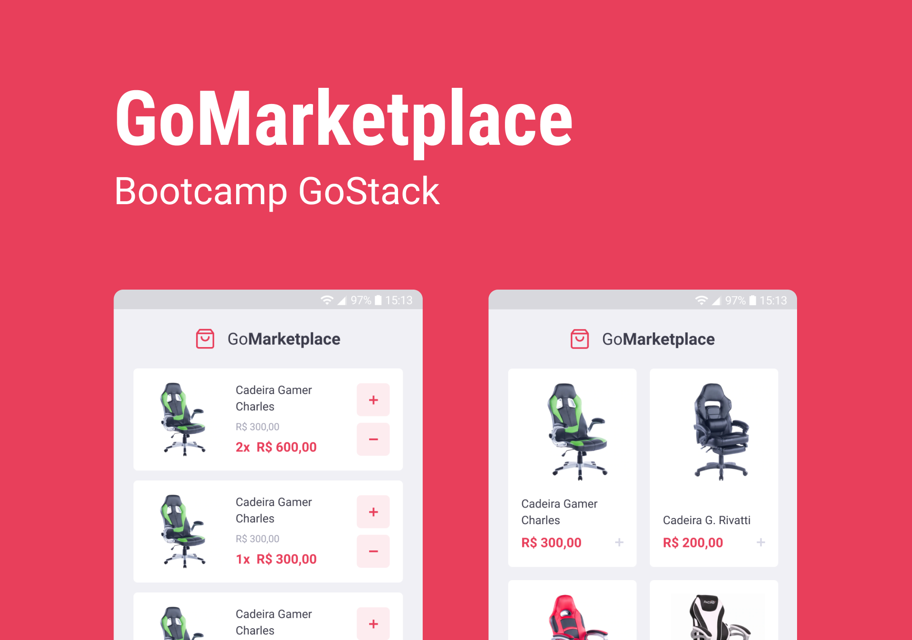

<h1 align="center">GoMarketplace</h1>

<p align="center">
  

  

  

  <a href="https://github.com/amandavianna/desafio-fundamentos-react-native/commits/master">
    
  </a>
</p>

Aplicação GoMarketplace, utilizando React Native junto com o TypeScript, rotas, Async Storage e Context API.



## Como usar:

```bash
# Clone this repository
$ git clone https://github.com/amandavianna/desafio-fundamentos-react-native

# Go into the repository
$ cd desafio-fundamentos-react-native

# Install dependencies
$ yarn
$ cd ios/
$ pod install
$ cd ..

# Run the app
$ yarn ios
```

```bash
# Fake API
$ yarn json-server server.json -p 3333
```
